 <h1 align="center">Game of Green</h1>
 Vienna's Game of Green is an Urban Green Analysis Toolbox showing the power of how planting a tree can make an environmental change 

<!-- CONTENTS -->

  ## 
Table of Contents

  <ol>
    <li><a href="#about-the-project">About The Project</a>
      <ul>
        <li><a href="#project-presnetation">Project Presnetation</a></li>
        <li><a href="#project-blogpost">Project Blogpost</a></li>
        <li><a href="#project-webapp">Project WebApp</a></li>
        <li><a href="#project-deployment">Project Deployment</a></li>
        <li><a href="#aia22-webapp">AIA22 WebApp</a></li>
        <li><a href="#how-to-use-this-repo">How to Use This Repo</a></li>
      </ul>
    <li><a href="#project-task">Project Task</a></li>
    <li><a href="#dataset-creation">Dataset Creation</a></li>
    <li><a href="#methodology">Methodology</a></li>
    <li><a href="#results">Results</a></li>
    <li><a href="#user-interface">User Interface</a></li>
    <li><a href="#website-showcase">Website Showcase</a></li>
    <li><a href="#future-potential">Future Potential</a></li>
    <li><a href="#credits">Credits</a></li>
  </ol>

<!-- ABOUT THE PROJECT -->
## About The Project
This is a packaged repository for the final project "Game of Green", created at the Masters in Advanced Computation for Architecture and Design by: <a href="https://github.com/charbelllll" target="_blank">Charbel Baliss</a>,<a href="https://github.com/lucialef" target="_blank">Lucia Leva</a>, <a href="https://github.com/jacintomoros" target="_blank">Jacinto Moros</a>, and  <a href="https://github.com/JumanaHamdani" target="_blank">Jumana Hamdani</a>. Faculty: Angelos Chronis,  Aleksandra Jastrzębska, Nariddh Khean & Serjoscha Duering. The repository contains all the necessary information, datasets, notebooks, and links to re-create the project from scratch.

Project Presnetation:  <a href="https://docs.google.com/presentation/d/1VXSuWvEo91wP0wcBf--FRdPsBqciuY39ze6NryveCgw/edit?usp=sharing" target="_blank">Game of Green Blog</a>   
Project Blogpost:      <a href="https://www.iaacblog.com/programs/game-green-urban-green-analysis-toolbox/" target="_blank">Game of Green Blog</a>   
Project WebApp:        <a href="http://aia22.iaac.net:8080/g8" target="_blank">Game of Green Website</a>   
Project Deployment:    <a href="http://aia22.iaac.net:8080/g8/map" target="_blank">Game of Green Map</a>   
AIA22 WebApp:          <a href="http://aia22.iaac.net:8080/" target="_blank">AIA22 Website</a>   

## How To Use This Repo
01. Use <a href="Collabs/01_GAME_OF_GREEN_EXTRACT_DATA.ipynb" target="_blank">The 1st Collab</a> to extract the data from:
 - Study points dataset from QGIS. you can find the geojson file of the streets points in <a href="https://drive.google.com/file/d/1hdL0OvPkrSNWfaoibtSDqB0o2tm46R8I/view?usp=sharing" target="_blank">here</a>
 - OSM using OSMNX library (https://www.openstreetmap.org/)
 - The POWER Project by NASA using it's API (https://power.larc.nasa.gov/) Provides solar and meteorological data sets from NASA research for support of renewable energy, building energy efficiency and agricultural needs.
 - Open Data from Austria's Goverment Web (https://www.data.gv.at/)
 - Public Open Data (https://public.opendatasoft.com/)
 - NEIGHBOR METHOD :https://automating-gis-processes.github.io/site/notebooks/L3/nearest-neighbor-faster.html
 - Process data
 - Create graph network
 - Define green scoring criteria
 - Apply and add scoring to study points dataset
 - Export processed data and feed it to the next notebook. you can find all the exported scored values of all the years between 2000 to 2021 in <a href="https://drive.google.com/drive/folders/1_awCAhXaYtm5TRWiBMFtTSpxvn6DCx4s?usp=sharing" target="_blank">here</a>
 

02. Use <a href="02_GAME_OF_GREEN_NORMALIZE_&_SCORE.ipynb" target="_blank">The 2nd Collab</a> to score and create the geojson. This collab is used to:
 - Import GEOJSON from WEB. you can find a list of climate scored data per year in <a href="https://drive.google.com/drive/folders/1_awCAhXaYtm5TRWiBMFtTSpxvn6DCx4s?usp=sharing" target="_blank">here</a>
 - Predict targets.
 - Normalize by criteria.
 - Score Data by criteria.
 - In this collab we exported also <a href="https://drive.google.com/drive/folders/1-e0uGTh7uD928g7CSSsHwliY3w0MciKX?usp=sharing" target="_blank">geojason files</a> for CARTO to visulize them in a map
 
 
03. Use <a href="03. GAME OF GREEN_LINEAR REGRESSION.ipynb" target="_blank">The 3rd Collab</a> to obtain linear regression cooefficient, in order to predict future score. 
- Make sure you use the final CSV file <a href="https://drive.google.com/file/d/1cIhSnItm5tpEGkFkKcUBSL9wgDfIwuRl/view?usp=sharing" target="_blank">here</a>

04. Use <a href="04_GAME_OF_GREEN_MODEL_PY_WEB.ipynb" target="_blank">The 4th Collab</a> to deploy the project in the webapp. Make sure you use the final geojason file in <a href="https://drive.google.com/file/d/1ZxkEP8h0wIPpwsX6nYB83i6E2-_j5jcs/view?usp=sharing" target="_blank">here</a>

(<a href="#top">back to top</a>)

<!-- project-task -->
## Project Task

- Due to the fast urbanization in the cities, the greenery qualities are decreasing,and limiting the access to nature. All that leads to certain environmental hazards, such as air pollution, raise temperature, and other global warming issues. 

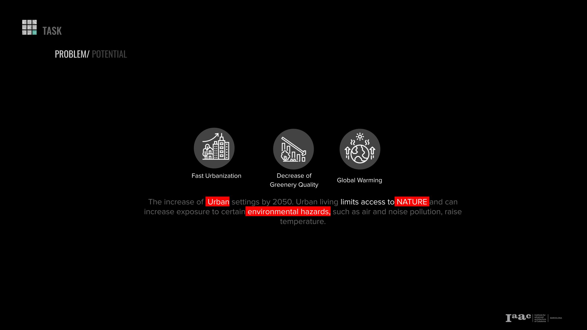

- From there looking at the distribution of the greeneries in the city of Vienna, we noticed that the green fields are condensed on the borders while leaving the center with a poor green quality

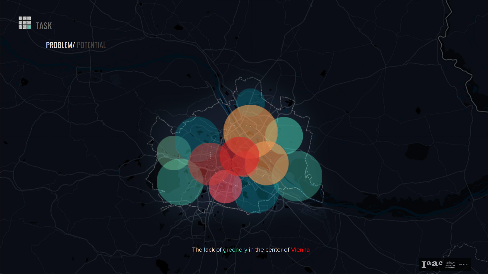

- And In alignment of both The Smart City Wien Framework Strategy and the UN 2030 Agenda of more green spaces interventions can improve the environmental conditions.

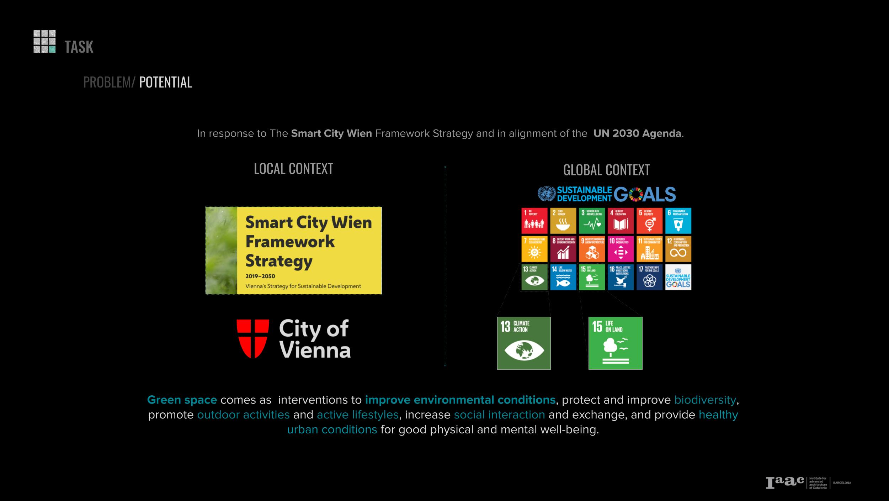

- Our project comes as a solution. Game of Green that responds to the  lack of Greeneries  in the city  of Vienna specially the central area.Designed for the  decision makers  including urban planners, architects, politicians and even inhabitants to participate with their opinions for a better future. Game of Green will propose the optimal locations of planting trees, displaying a score map where adding a tree can make an environmental change.

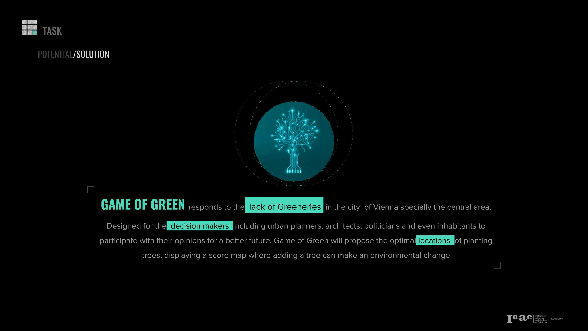

(<a href="#top">back to top</a>)

<!-- dataset-creation -->
## Dataset Creation
- We’ll take you now to the process of how we executed our project
- We started with Dataset creation by dividing the street networks of Vienna into point every 10m , resulting with more than 800,000 study points.

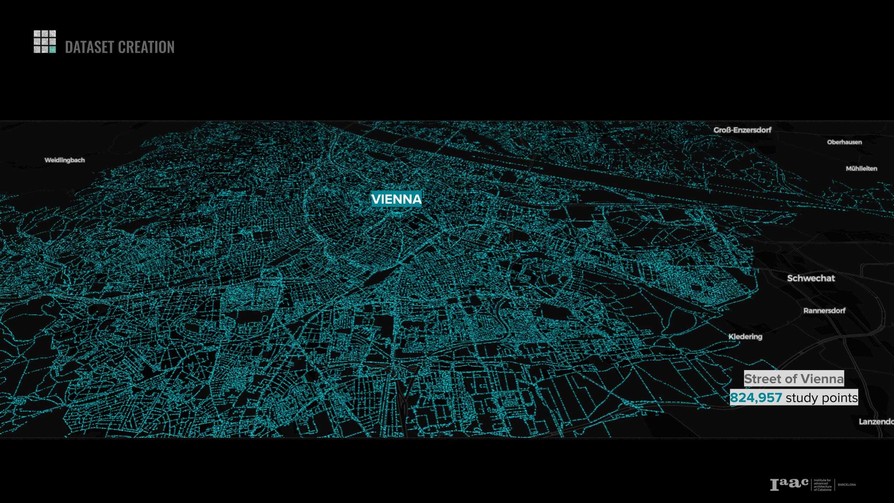

- We extracted  a time series Data from Open Data Austria, OSMX, and Nasa Power.
- These are the features used for training our Machine learning models
- We compile them all on the study points from the street network, distributed over all Vienna.

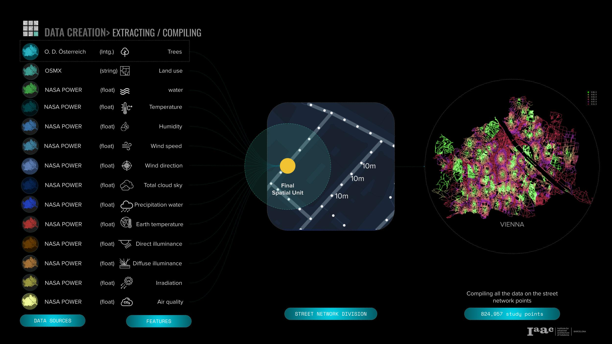

- We scored our features from 0 to 1 based on the best and worst conditions for trees to thrive. For example the Value temperature is best for plants between 20 and 40 degrees, while less or more than that range can be challenging.

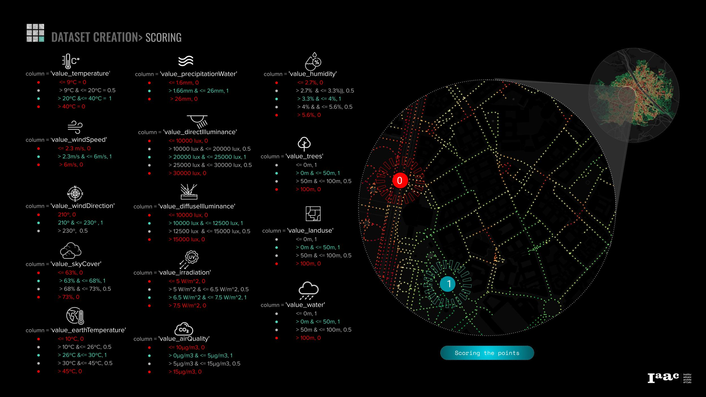

- Then we scaled our points from 0 to 10, Resulting 0 as a red color point, and 10 as green color point. Here’s an example of two places close to each other that has different scores, one with the worst green quality, and the other with the best quality.

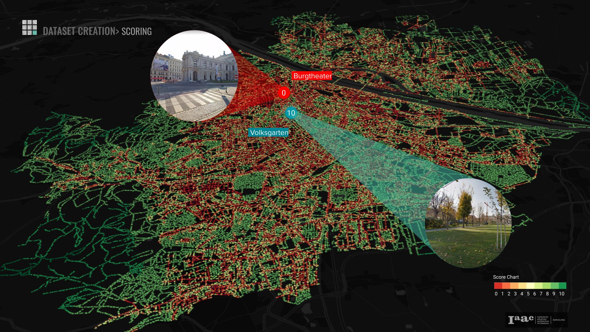

(<a href="#top">back to top</a>)

<!-- metholdology -->
## Methodology

- Before training our models , We ran a PCA on our dataset to double check if multi-co-llinearity exists among our features. Then we decided to go with 2 Linear Regression models as we have linear relationships between our variables. One to predict the 2022 Score, Before adding trees. And the other to predict the 2022 Score, after adding trees.

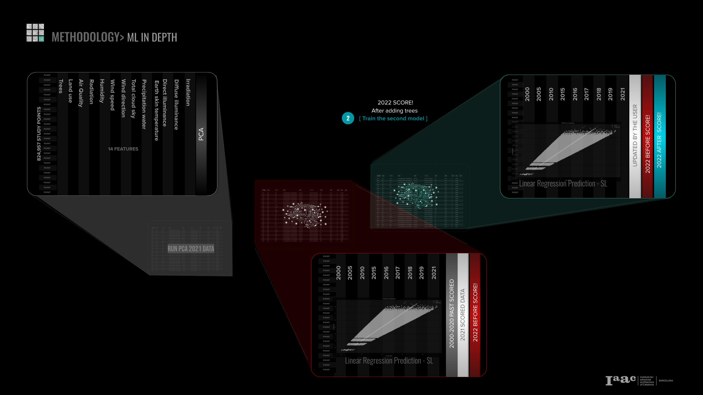

So our methodology would look as follows:

- compiling the features, scoring them, run a PCA analysis
- we trained the two models: The Red one to predict the score before adding trees, and the second is the Green one to predict the same score after the user adds trees within a range of area.
- The output would be two scores to compare After and Before adding trees.

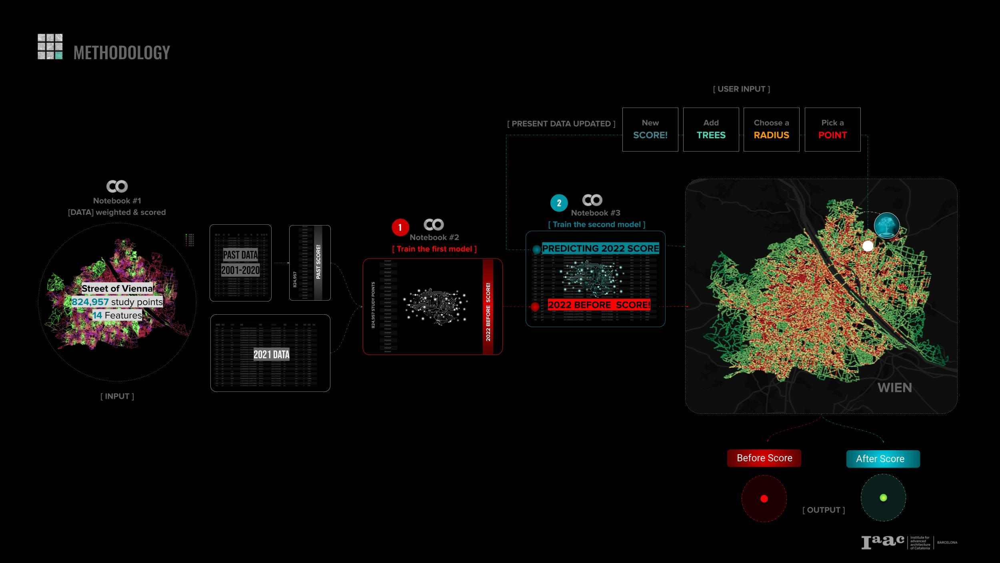

(<a href="#top">back to top</a>)

<!-- results -->
## Results

- The result of this project is an URBAN GREEN ANALYSIS TOOLBOX showing the power of how planting a tree can make an environmental change.

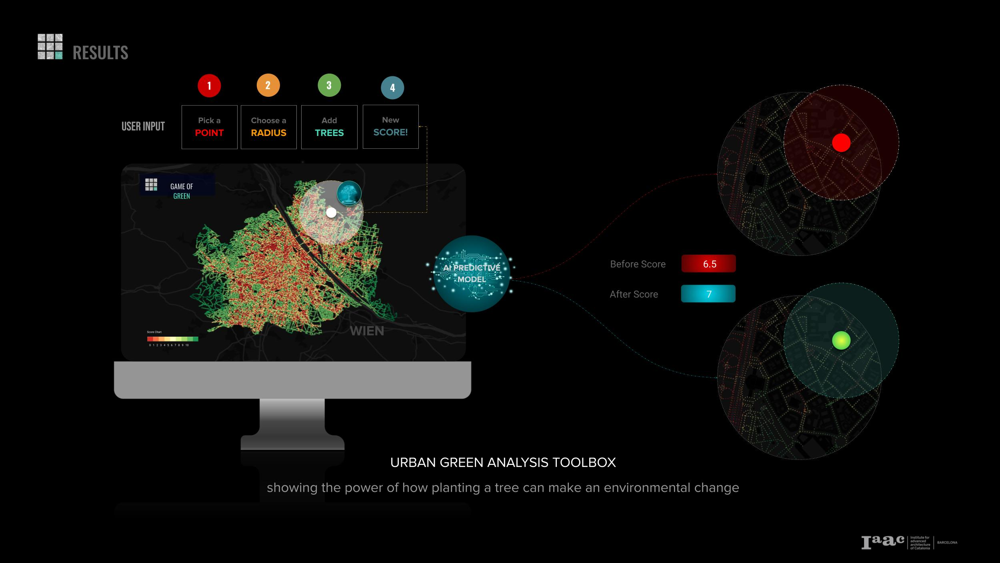

(<a href="#top">back to top</a>)

<!-- user-interface -->
## User Interface

- On the INTERACTIVE MAP the user will be visualising colored points revealing areas of the city that could be rewilded and where the areas that are in a good condition. The user would pick a point,  select a radius defining the area to be modified, setting a number of trees to be added.

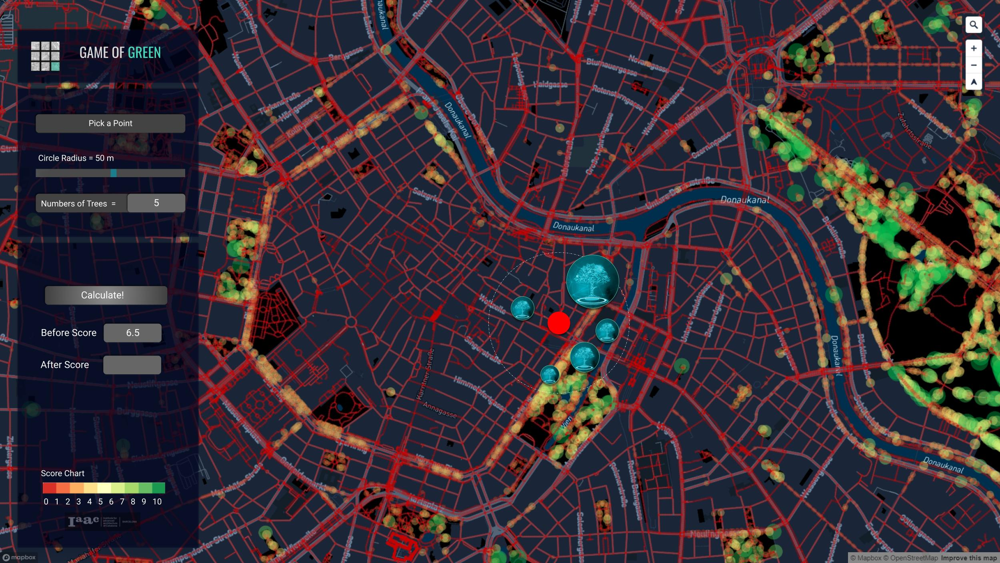

- And then calculate the a new score after adding trees, the interactive map would return with a different color within the scoring chart range between red and green, and a score value of both between the range of 0 to 10.

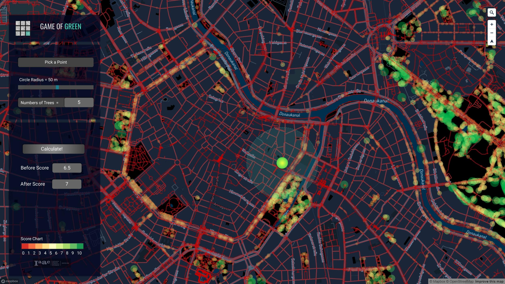

(<a href="#top">back to top</a>)

<!-- website-showcase -->
## Website Showcase

- Here’s a the website showcase, visualizing how the user can zoom in to inspect which areas are most needed for change:

(<a href="#top">back to top</a>)

<!-- future-potential -->
## Future Potential

or the future potentials>

- Adding other factors not only trees, e.g. water elements, and land use
- Integrating more UN goals into the project for example sustainable cities and communities
- Including biodiversity data as other species are part of larger ecosystem
- integrating Urban planning tools to analyze it together with environmental, climate, economic and represent them in map layers
- Contributing to Open Data Ostrich , as the UI action can be also document any observation of the surrounding environment, not only interacting with interface

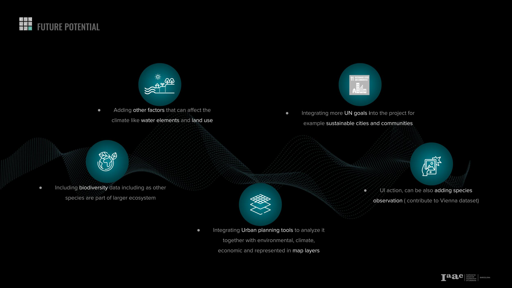

(<a href="#top">back to top</a>)

<!-- credits -->
## Credits

GAME OF GREEN is a project of IAAC, Institute for Advanced Architecture of Catalonia developed in the Master of Advanced Computation in Architecture and Design  2021/22 by: Charbel Baliss, Lucía Leva, Jacinto Moros & Jumana Hamdani. Faculty: Angelos Chronis, Aleksandra Jastrzębska, Nariddh Khean & Serjoscha Duering.

(<a href="#top">back to top</a>)

