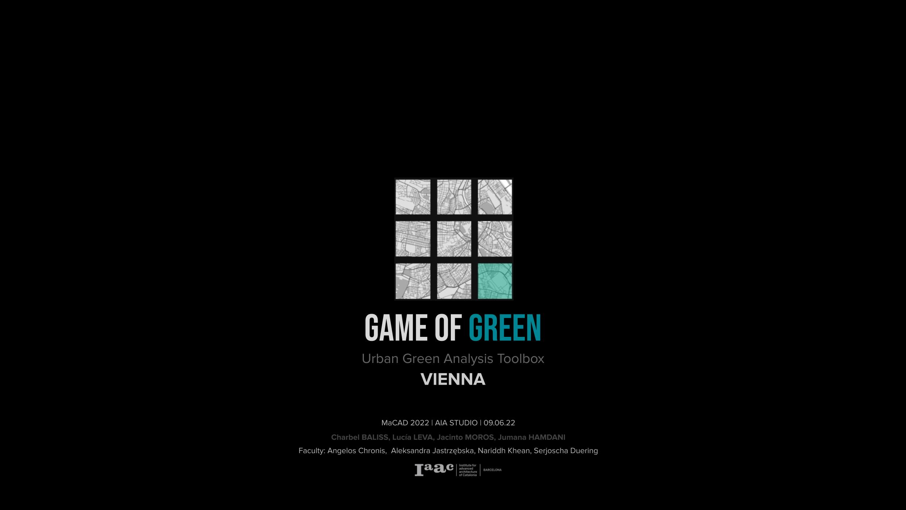

 

   </a>
  <h1 align="center">Game of Green</h1>
  Urban Green Analysis Toolbox
  

<!-- CONTENTS -->

  
Contents

  <ol>
    <li><a href="#about-the-project">About The Project</a>
      <ul>
        <li><a href="#project-presnetation">Project Presnetation</a></li>
        <li><a href="#project-blogpost">Project Blogpost</a></li>
        <li><a href="#project-webapp">Project WebApp</a></li>
        <li><a href="#project-deployment">Project Deployment</a></li>
        <li><a href="#aia22-webapp">AIA22 WebApp</a></li>
      </ul>
    <li><a href="#task">Task</a></li>
    <li><a href="#dataset-creation">Dataset Creation</a></li>
    <li><a href="#methodology">Methodology</a></li>
    <li><a href="#results">Results</a></li>
    <li><a href="#user-interface">User Interface</a></li>
    <li><a href="#website-showcase">Website Showcase</a></li>
    <li><a href="#future-potential">Future Potential</a></li>
    <li><a href="#credits">Credits</a></li>
  </ol>

<!-- ABOUT THE PROJECT -->
## About The Project
#### Vienna's Game of Green is an Urban Green Analysis Toolbox showing the power of how planting a tree can make an environmental change

Project Presnetation:  <a href="https://docs.google.com/presentation/d/1VXSuWvEo91wP0wcBf--FRdPsBqciuY39ze6NryveCgw/edit?usp=sharing" target="_blank">Game of Green Blog</a>   
Project Blogpost:      <a href="https://www.iaacblog.com/programs/game-green-urban-green-analysis-toolbox/" target="_blank">Game of Green Blog</a>   
Project WebApp:        <a href="http://aia22.iaac.net:8080/g8" target="_blank">Game of Green Website</a>   
Project Deployment:    <a href="http://aia22.iaac.net:8080/g8/map" target="_blank">Game of Green Map</a>   
AIA22 WebApp:          <a href="http://aia22.iaac.net:8080/" target="_blank">AIA22 Website</a>   

(<a href="#top">back to top</a>)

<!-- task -->
## Task

text

(<a href="#top">back to top</a>)

<!-- dataset-creation -->
## Dataset Creation

text

(<a href="#top">back to top</a>)

<!-- metholdology -->
## Methodology

text

(<a href="#top">back to top</a>)

<!-- results -->
## Results

text

(<a href="#top">back to top</a>)

<!-- user-interface -->
## User Interface

text

(<a href="#top">back to top</a>)

<!-- website-showcase -->
## Website Showcase

text

(<a href="#top">back to top</a>)

<!-- future-potential -->
## Future Potential

text

(<a href="#top">back to top</a>)

<!-- credits -->
## Credits

text

(<a href="#top">back to top</a>)

